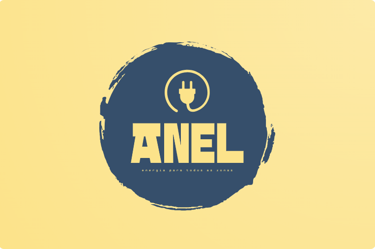
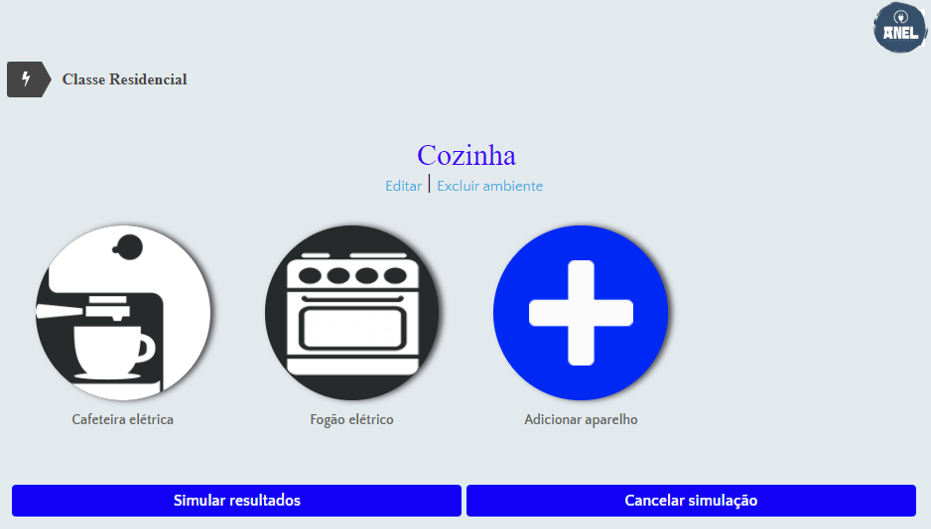
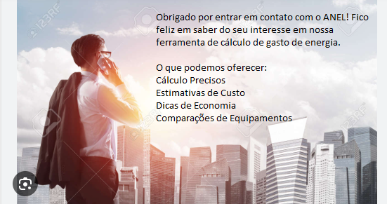

<h1 align="center">Um metodo revolucionario para gerenciar o seu gasto de energia</h1>

Você sabia que saber o quanto você gasta em energia pode fazer toda a diferença na sua economia mensal e na preservação ambiental? No ANEL, estamos aqui para tornar o cálculo do seu consumo de energia simples, preciso e eficiente.

A ANEL é uma plataforma inovadora que permite a você calcular o gasto de energia dos seus aparelhos e sistemas domésticos ou comerciais. Com nossa ferramenta intuitiva e fácil de usar, você pode:

- Calcular o Consumo: Descubra o consumo de energia de diferentes dispositivos e eletrodomésticos em sua casa ou empresa.

- Estimativas Precisas: Obtenha uma estimativa precisa do seu gasto mensal e anual com energia.
Economia de Energia: Identifique oportunidades para reduzir o consumo e, consequentemente, suas contas de energia.

- Comparação de Equipamentos: Compare a eficiência energética de diferentes aparelhos e faça escolhas mais informadas.

"Transforme a maneira como você consome energia e comece a economizar hoje – um cálculo inteligente pode ser o primeiro passo para um futuro mais sustentável e econômico."

